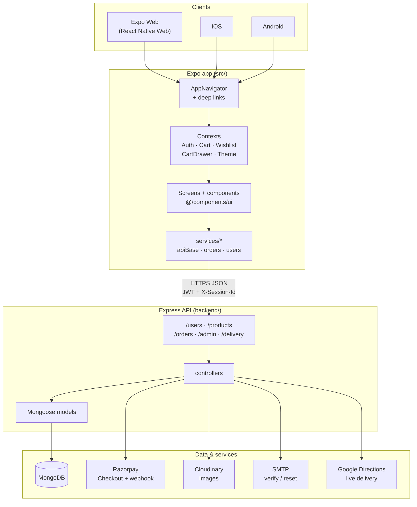

# Zeevan architecture

One-page overview of how the Expo client, Express API, and integrations fit together. For file-size risks, duplication, and migration plans, see the **[May 2026 codebase audit](./audit-2026-05.md)** (PROMPT 0.1).

## System diagram

## Request flow (happy path)

1. **Browse:** `productService` → `GET /products` (or `/api/products`) → list/grid on `HomeScreen` / PLP.
2. **Auth:** `userService` → `POST /users/login` → `AuthContext` stores access/refresh tokens and session id (Secure Store / AsyncStorage).
3. **Cart:** Local `CartContext` merges with server cart when logged in; `CartDrawer` overlays checkout entry.
4. **Checkout:** `POST /orders` creates a pending order → Razorpay client opens with `EXPO_PUBLIC_RAZORPAY_KEY_ID` → `POST /orders/:id/verify-payment` → webhook confirms payment.
5. **Account:** `AccountNavigator` stack (orders, addresses, wishlist, profile) shares `CustomerScreenShell` / `AccountLayout`.

## Major React contexts

| Context | File | Responsibility |
| --- | --- | --- |
| **Theme** | `src/context/ThemeContext.js` | Light/dark mode, `useTheme()` tokens (`c`, `S`, `R`, `SH`, `T`, `M`), legacy `colors`, `customerAlchemy` |
| **Auth** | `src/context/AuthContext.js` | Login/register/session refresh, profile, role (customer/admin/delivery), gated navigation |
| **Cart** | `src/context/CartContext.js` | Line items, quantities, persistence, server sync when authenticated |
| **Wishlist** | `src/context/WishlistContext.js` | Saved products, move-to-cart helpers |
| **CartDrawer** | `src/context/CartDrawerContext.js` | Global mini-cart / checkout panel open state (especially web) |

Provider order in `App.js`: `ThemeProvider` → `AuthProvider` → `CartProvider` → `WishlistProvider` → `CartDrawerProvider` → navigation.

## Design tokens

Canonical values live in **`src/theme/tokens.js`** (`COLORS`, `SPACING`, `RADII`, `SHADOWS`, `TYPE`, `MOTION`). Screens should consume **`useTheme()`** aliases instead of raw hex or magic numbers. Drift is reported by `npm run check:tokens` (see `docs/token-violations-baseline.txt`).

## API surface (summary)

| Area | Prefix | Notes |
| --- | --- | --- |
| Catalog | `/products` | Public listing and PDP |
| Users | `/users` | Register, login, refresh, profile, cart, notifications |
| Orders | `/orders` | Create, pay, webhooks, my orders, delivery location |
| Admin | `/admin` | Products, orders, users, analytics, coupons |
| Delivery | `/delivery` | Role-based delivery dashboard APIs |

Duplicate mounts under `/api/*` exist for deployments that reverse-proxy only `/api`.

## Integration readiness & boot behavior

- `GET /health` returns runtime integration state: `mongo`, `cloudinary`, `razorpay`, `smtp`.
- Third-party integrations are lazy-loaded and feature-gated to avoid startup crashes:
  - Missing Cloudinary no longer blocks API boot; upload endpoints return `503 image_uploads_disabled`.
  - Razorpay and SMTP are initialized only when their features are used.

## Related documentation

| Doc | Contents |
| --- | --- |
| [decisions/0001-oauth.md](./decisions/0001-oauth.md) | Social sign-in hidden until OAuth ships |
| [audit-2026-05.md](./audit-2026-05.md) | Git hygiene, oversized files, Premium→ui duplication, risk flags |
| [ui-migration.md](./ui-migration.md) | Screen-by-screen UI primitive migration |
| [token-violations-baseline.txt](./token-violations-baseline.txt) | Token linter baseline counts |
| [web-vitals.md](./web-vitals.md) | Core Web Vitals targets, hero/font/bundle optimizations |
| [observability.md](./observability.md) | Sentry, error boundaries, `/health`, RUM |
| [smoke-test.md](./smoke-test.md) | Pre-deploy manual checklist |
| [known-issues.md](./known-issues.md) | Platform edge cases (Android Chrome viewport, etc.) |
| [a11y-report.json](./a11y-report.json) | Latest axe smoke (6 routes) |
| [perf/final-summary.json](./perf/final-summary.json) | Lighthouse desktop/mobile + bundle snapshot |

## Performance & observability (May 2026)

- **Code-splitting:** `lazyOpsScreens.web.js`, `lazyCustomerScreens.web.js`, dynamic GSAP/Leaflet.
- **LCP:** WebP hero srcset in `public/assets/hero/`, preload in `post-export-web.js` + `webHead.web.js`.
- **Fonts:** Self-hosted woff2, `font-display: swap`, preload Inter 400/500 + Playfair 600.
- **Images:** Cloudinary product URLs use `f_webp` via `buildResponsiveImageSources()`.
- **RUM:** `web-vitals` → `reportWebVitals.web.js` (console dev, optional `EXPO_PUBLIC_WEB_VITALS_ENDPOINT`).
- **Errors:** `AppErrorBoundary` + per-route `RouteErrorBoundary`; Sentry client (`src/observability/sentry.web.js`) + backend (`backend/src/observability/sentry.js`).
- **Health:** `GET /health` and `GET /api/health` report Mongo + integration readiness.
| [ui-overhaul-baseline-report.md](./ui-overhaul-baseline-report.md) | Route-to-shell matrix |

## Security notes

- **Never** ship `JWT_SECRET`, `RAZORPAY_KEY_SECRET`, or `RAZORPAY_WEBHOOK_SECRET` to the client.
- Only `EXPO_PUBLIC_*` vars belong in the Expo app `.env`.
- CORS allows known Expo web origins; extend with `CORS_ORIGINS` for custom hosts.
