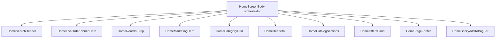

# Home Architecture

## Composition Diagram

## Hook Responsibilities

- `useHomeData`: home products/config fetch, cache-aware loading and refresh state.
- `useHomeFilters`: query, section/category filtering, derived section list.
- `useReorderData`: reorder candidates and refresh.
- `useLiveOrder`: active order summary used for pinned card.
- `useHeroSlider`: hero autoplay, index control, user-interaction pause/resume.
- `useCartFeedback`: add-to-cart fly animation, toast queue, cart anchor tracking, reduced-motion fallback.
- `useNotifications`: unread count and notification refresh.
- `useScrollY`: shared scroll state store fed by the root home `ScrollView` `onScroll`.

## Scroll Source Of Truth (Web)

- Chosen architecture: **Option B** (RN `ScrollView` is the single source on web; Lenis disabled for home).
- Why: this removes desync between `window` scroll and inner RN web scroll, which was causing sticky thresholds and reveal triggers to drift.
- Implementation:
  - `HomeScreenBody` now updates `scrollY` and `setScrollYStore` from one `ScrollView.onScroll` path on all platforms.
  - No Lenis initialization in home web path.
  - Pull-to-refresh invalidates cached orders first, then refetches.
  - Dev-only HUD (`Platform.OS === "web" && __DEV__`) shows live `scrollY` in the corner for threshold debugging.
- Verified behavior targets:
  - Search header blur threshold engages consistently.
  - Sticky add-to-bag trigger remains stable.
  - Section reveal timing is no longer tied to a second scroll system.

## Section Ownership (Copy + UX)

- Home (`HomeScreenBody` path):
  - Fast decision surfaces (search, reorder, categories, deals, catalog, offers)
  - Short transactional copy and action CTAs
  - Trust summary only in footer pills (no mid-page trust strip)
- About / brand storytelling:
  - Extended trust narrative, long-form brand claims, mission copy
  - Deep testimonials and heritage storytelling (not in the home commerce path)
- PDP (product detail page):
  - Product-specific education (ingredients, sourcing, usage, care)
  - Purchase confidence details tied to the selected SKU

## Current Render Policy Checks

- Home render excludes `HOME_STATS_STRIP` and `HOME_TESTIMONIALS`.
- Home no longer renders `HOME_TRUST_BANNER` in the main feed.
- Home includes `HomeOffersBand` above footer.
- Deals and reorder labels remain short/action-oriented.
