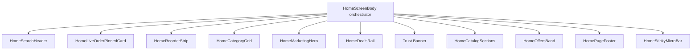

# Home Architecture

## Composition Diagram

## Hook Responsibilities

- `useHomeData`: home products/config fetch, cache-aware loading and refresh state.
- `useHomeFilters`: query, section/category filtering, derived section list.
- `useReorderData`: reorder candidates and refresh.
- `useLiveOrder`: active order summary used for pinned card.
- `useHeroSlider`: hero autoplay, index control, user-interaction pause/resume.
- `useCartFeedback`: add-to-cart fly animation, toast queue, cart anchor tracking.
- `useNotifications`: unread count and notification refresh.

## Section Ownership (Copy + UX)

- Home (`HomeScreenBody` path):
  - Fast decision surfaces (search, reorder, categories, deals, catalog, offers)
  - Short transactional copy and action CTAs
  - Trust summary only (single compact banner + footer pills)
- About / brand storytelling:
  - Extended trust narrative, long-form brand claims, mission copy
  - Deep testimonials and heritage storytelling (not in the home commerce path)
- PDP (product detail page):
  - Product-specific education (ingredients, sourcing, usage, care)
  - Purchase confidence details tied to the selected SKU

## Current Render Policy Checks

- Home render excludes `HOME_STATS_STRIP` and `HOME_TESTIMONIALS`.
- Home includes `HOME_TRUST_BANNER` and `HomeOffersBand`.
- Deals and reorder labels remain short/action-oriented.
